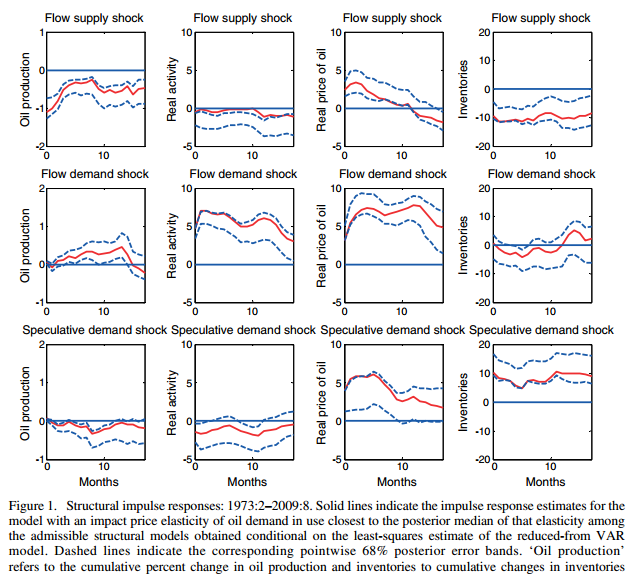

```{r, include=F}
require(ggplot2)
require(data.table)
require(grid)
require(gridExtra)
require(R.matlab)
```

```{r, cache=T}
bayesPosterior <- readMat('../BayesPosterior.mat'); IRMposs <- bayesPosterior$IRMposs
IRFelas <- readMat('../IRFelas.mat'); IRFelas <- IRFelas$IRFelas;
findex <- readMat('../findex.mat'); findex <- findex$findex;

xmax = 17
mindist <- 0.0061

IRF <- IRFelas[,,findex]
time <- c(0:xmax);
CI <- apply(IRMposs, c(1,2), quantile, probs = c(.16,.84))
CI1458912=apply(apply(IRMposs, c(1,3), cumsum), c(1,2), quantile, probs = c(.16,.84))
for (i in c(1, 4, 5, 8, 9, 12)) {
  CI[, i, ] <- CI1458912[, , i]
}

CI5 = apply(IRMposs, c(1,2), quantile, probs=c(.025, .975))
CI5_1458912=apply(apply(IRMposs, c(1,3), cumsum), c(1,2), quantile, probs = c(.025, .975));
for (i in c(1, 4, 5, 8, 9, 12)) {
  CI5[, i, ] <- CI5_1458912[, , i]
}
```

```{r, cache=T}
fn <- function(title, Months, ylabel, y, yl, yu, ylim) {
  df <- data.frame(Months=Months, ylabel = y, yl = yl, yu = yu)
  ggplot(df, aes(x=Months)) +
    geom_line(aes(y=ylabel), color='red') +
    geom_line(aes(y=yl), color='blue', linetype='dashed') +
    geom_line(aes(y=yu), color='blue', linetype='dashed') +
    geom_hline(aes(yintercept=0)) +
    scale_y_continuous(limits = ylim) +
    ggtitle(title) +
    labs(y = ylabel) +
    theme(axis.text=element_text(size=6),
          axis.title=element_text(size=8),
          plot.title=element_text(size=8))
}
```


```{r, cache=T}
g1 <- fn('Flow Supply Shock', time, 'Oil Production', -cumsum(IRF[1,]), -CI[1,1,], -CI[2,1,], c(-2,2))
g5 <- fn('Flow Demand Shock', time, 'Oil Production', cumsum(IRF[5,]), CI[1,5,], CI[2,5,], c(-2,2))
g9 <- fn('Speculative Demand Shock', time, 'Oil Production', cumsum(IRF[9,]), CI[1,9,], CI[2,9,], c(-2,2))

g2 <- fn('Flow Supply Shock', time, 'Real Activity', -IRF[2,], -CI[1,2,], -CI[2,2,], c(-10,10))
g6 <- fn('Flow Demand Shock', time, 'Real Activity', IRF[6,], CI[1,6,], CI[2,6,], c(-10,10))
g10 <- fn('Speculative Demand Shock', time, 'Real Activity', IRF[10,], CI[1,10,], CI[2,10,], c(-10,10))

g3 <- fn('Flow Supply Shock', time, 'Real Price of Oil', -IRF[3,], -CI[1,3,], -CI[2,3,], c(-10,10))
g7 <- fn('Flow Demand Shock', time, 'Real Price of Oil', IRF[7,], CI[1,7,], CI[2,7,], c(-10,10))
g11 <- fn('Speculative Demand Shock', time, 'Real Price of Oil', IRF[11,], CI[1,11,], CI[2,11,], c(-10,10))

g4 <- fn('Flow Supply Shock', time, 'Inventories', -cumsum(IRF[4,]), -CI[1,4,], -CI[2,4,], c(-20,20))
g8 <- fn('Flow Demand Shock', time, 'Inventories', cumsum(IRF[8,]), CI[1,8,], CI[2,8,], c(-20,20))
g12 <- fn('Speculative Demand Shock', time, 'Inventories', cumsum(IRF[12,]), CI[1,12,], CI[2,12,], c(-20,20))

globs <- list(g1,g2,g3,g4,g5,g6,g7,g8,g9,g10,g11,g12)
```

## Original Figure 1: Structural Impulse Responses
  


## Replicated Figure 1: Structural Impulse Responses
```{r, fig.height=8}
grid.arrange(grobs=globs, layout_matrix = matrix(1:12, byrow = T,nrow=3))
```

