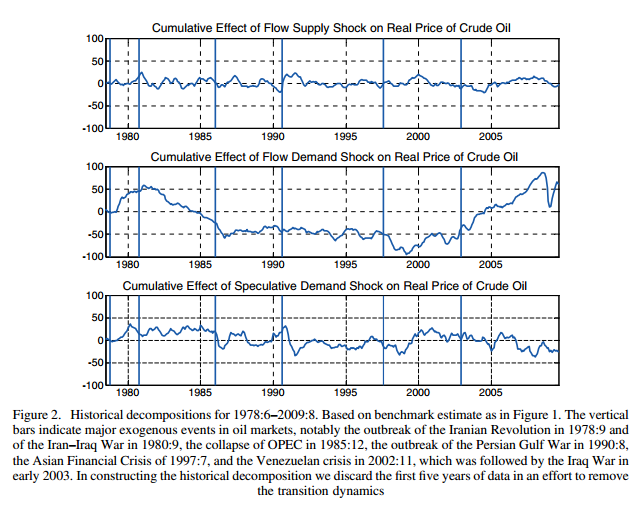

```{r, include=F}
require(ggplot2)
require(data.table)
require(grid)
require(gridExtra)
require(R.matlab)
require(DescTools)
```

```{r, cache=T}
bayesPosterior <- readMat('../BayesPosterior.mat'); IRMposs <- bayesPosterior$IRMposs
IRFelas <- readMat('../IRFelas.mat'); IRFelas <- IRFelas$IRFelas;
findex <- readMat('../findex.mat'); findex <- findex$findex;
U <- readMat('../U.mat'); U <- U$U
BETAnc <- readMat('../BETAnc.mat'); BETAnc <- BETAnc$BETAnc

IdentMat <- matrix(IRFelas[,1,findex], nrow=4)
Uhat <- U
p=24;
t=439; # length(kmData)
K <- nrow(IdentMat)
q <- ncol(IdentMat)

# Compute structural multipliers
A = rbind(BETAnc, cbind(diag(K*(p-1)), diag(x=0, K*(p-1), K)))
J = cbind(diag(K), diag(x=0, K, K*(p-1)))
IRF = matrix(J %*% (A %^% 0) %*% t(J) %*% IdentMat, nrow = K^2, ncol = 1)
for (i in 1:(t-p-1)) {
  IRF = cbind(IRF, matrix(J %*% (A %^% i) %*% t(J) %*% IdentMat, nrow = K^2, ncol = 1))
}

# Compute structural shocks Ehat from reduced form shocks Uhat
Ehat = MASS::ginv(IdentMat) %*% Uhat[1:q,];

# Cross-multiply the weights for the effect of a given shock on the real
# oil price (given by the relevant row of IRF) with the structural shock
# in question
yhat1 = diag(x=0,t-p,1);
yhat2 = diag(x=0,t-p,1);
yhat3 = diag(x=0,t-p,1);
yhat4 = diag(x=0,t-p,1);
for (i in 1:(t-p)) {
  yhat1[i,] = IRF[3, 1:i] %*% Ehat[1, i:1]
  yhat2[i,] = IRF[7, 1:i] %*% Ehat[2, i:1]
  yhat3[i,] = IRF[11, 1:i] %*% Ehat[3, i:1]
  yhat4[i,] = IRF[15, 1:i] %*% Ehat[4, i:1]
}

time = seq(from = (1973+2/12+1/12*p), to = 2009+8/12, by = 1/12); # starts at 1975.2
cumshock = yhat1 + yhat2 + yhat3 + yhat4;
```

```{r, cache = T}
df <- data.frame(Years=time, CumEffect=yhat1)
g <- ggplot(mapping=aes(x=time)) + geom_vline(aes(xintercept=1978+9/12)) +
  geom_vline(aes(xintercept=1980+9/12)) +
  geom_vline(aes(xintercept=1985+12/12)) +
  geom_vline(aes(xintercept=1990+7/12)) +
  geom_vline(aes(xintercept=1997+7/12)) +
  geom_vline(aes(xintercept=2002+11/12)) +
  geom_vline(aes(xintercept=1980), linetype = 'dashed') +
  geom_vline(aes(xintercept=1985), linetype = 'dashed') +
  geom_vline(aes(xintercept=1990), linetype = 'dashed') +
  geom_vline(aes(xintercept=1995), linetype = 'dashed') +
  geom_vline(aes(xintercept=2000), linetype = 'dashed') +
  geom_vline(aes(xintercept=2005), linetype = 'dashed') +
  geom_hline(aes(yintercept=0), linetype = 'dashed') +
  geom_hline(aes(yintercept=-50), linetype = 'dashed') +
  geom_hline(aes(yintercept=50), linetype = 'dashed') +
  scale_y_continuous(limits = c(-100, 100)) +
  scale_x_continuous(breaks = seq(1980, 2005, by = 5)) +
  ylab('')
g1 <- g + geom_line(aes(y=yhat1), color='blue') +
  ggtitle('Cumulative Effect of Flow Supply Shock on Real Price of Crude Oil')
g2 <- g + geom_line(aes(y=yhat2), color='blue') +
  ggtitle('Cumulative Effect of Flow Demand Shock on Real Price of Crude Oil')
g3 <- g + geom_line(aes(y=yhat3), color='blue') +
  ggtitle('Cumulative Effect of Speculative Demand Shock on Real Price of Crude Oil')
```

### Original Figure 2: Historical Decompositions
  

\break

### Replicated Figure 2: Historical Decompositions
```{r, fig.height=6}
grid.arrange(grobs=list(g1,g2,g3), nrow=3)
```

### Comparision of Replication Results for Figure 2
Our replicated results for Figure 2 match very closely with the paper's results. Thus, our replicated results support the paper's analyis about what caused the oil price shock of 2003-2008. The standard interpretation for this sharp increase is (a) that there was an exogenous influx of financial investors into the oil futures market, (b) that this influx drove up oil futures prices, and (c) that the increase in oil futures prices was viewed by spot market praticipants as a signal of an expected increase in the price of oil, shifting inventory demand and hence causng the real spot price to increase. This explanation would necessitate that speculative demand shocks inthe structural model should explain the bulk of the price surge between 2003 and 2008. However, as the bottom graph of Figure 3 shows, there is no evidence to support this view; the cumulative effect of speculative demand shocks remained close to zero during that time period. A competing explanation posits that the price surge is a result of OPEC holding back its production after 2001 in anticipation of even higher oil prices in the future. In our model, such a move would be observationally equivalent to a negative flow supply shock. However, Figure 2 provides no indication that negative flow supply shocks were an important determinant of the real price of oil between 2003 and 2008. The small spike in flow supply shocks' cumulative effect on the real price of oil is dwarfed in comparison to flow demand shocks' cumulative effects during that period. Thus, our replicated findings support the paper's alternative explanation to price surge: the price surge between 2003 and 2008 was mainly caused by shifts in the flow demand for crude oil associated with the global business cycle. This finding is important because it implies that further regulation of oil markets would have done little to stem the increase in the price of oil. That is, there is no basis for the premise that such regulation is required to lower the real price of oil or that it would be helpful. Furthermore, the paper's structural model also implies that even dramatic increases in US oil production would not lower the real price of oil substantially at the global level.
