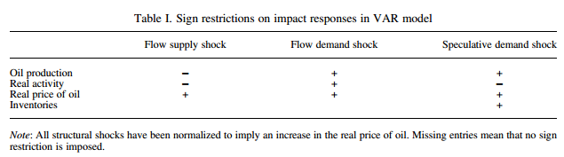

```{r, include=F}
library(knitr)
# opts_chunk$set(tidy.opts=list(width.cutoff=80),tidy=T)
options(scipen=999)

library(ggplot2)
library(gridExtra)
require(data.table)
theme_set(theme_bw())
```

\pagebreak

# I. Background Information
There are two main competing views of the global market for crude oil:  
  
  1. The price of oil is determined by desired stocks. Shifts in the expectations of forward-looking traders (hedgers and speculators) are reflected in changes in the real price of oil and in changes in oil inventories.
  2. The real price of oil is determined by shocks to the amount of oil coming out of the ground ("flow supply of oil") and the amount of oil being consumed ("flow demand for oil").

Recently, there has been increasing recognition that both elements of price determination matter. In _The Role of Inventories and Speculative Trading in the Global Market for Crude Oil (2013)_, Kilian and Murphy develop a structural vector autoregressive (VAR) model of the global market for crude oil that nests these two theories together and quantifies the effects of shocks to the speculative demand for oil as well as shocks to flow demand and flow supply of oil. The study stresses the importance of oil inventories data for building a model for price of crude oil. The paper attempts to indirectly identify the effects of shifts in expectations (i.e. without explicit measures of expectations) by including changes in oil inventories in their econometric model. They do this because reliable and substantial data on expectation shifts is not readily available, and because how subjective expectations are formed is too complicated of a nonlinear function to be practical in modeling. The model is built off of four main features (measured monthly from 1973:2 to 2009:8):

  1. Percent change in global crude oil production
  2. Index of global real activity in deviations from trend
  3. Real price of oil
  4. Change in above-ground global crude oil inventories
  
The authors assert that the variables are mutually endogenous. They include two years worth of lags in the model. The paper models four shocks as its responses:

  1. Flow supply shock - shock to the flow of crude oil production
  2. Flow demand shock - shock to the demand for crude oil driven by the global business
  3. Speculative demand shock - shock to the demand for above-ground oil inventories arising from forward-looking behavior
  4. Residual shock - captures all structural shocks not otherwise accounted for
  
\pagebreak

# II. Methods & Procedures

## VAR Methodology
The analysis is based on a dynaic simultaneous equation model in the form of a structural vector autoregression (VAR). Let $y_t$ be a vector of endogenous variables including the percent change in global crude oil production, a measure of global real activity, the real price of crude oil, and the change in global oil inventories above the ground. All data are aggregated monthly. The sample time period is 1973:2 to 2009:8. Seasonal variation is removed by including seasonal dummies in the VAR model. 

## Data
The dry cargo shipping rate index (as developed by Kilian, 2009a) are used as the measure for fluctuations in global real activity. This index is designed to capture shifts in the global use of industrial commodities. Data on global crude oil production are gathered from the *Monthly Energy Review* of the Energy Information Administration (EIA). Oil production is expressed in period-over-period percent changes in the model. The real price of oil is defined as the US refiners' acquisition cost for imported crude oil, as reported by the EIA, extrapolated from 1974:1 back to 1973:1 as in Barsky and Kilian (2002) and deflated by the US CPI. The data for total US crude oil inventories is also provided by the EIA. These data are scaled by the ratio of OECD petroleum stocks over US petroleum stocks, also obtained from the EIA. That scale factor ranges from about 2.23 to 2.59 in the paper's data sample. The resulting proxy for global crude oil inventories is expressed in unit changes rather than percent changes for two main reasons. Firstly, percent changes do not appear to be covariance stationary, whereas the unit changes do. Secondly, expressing in unit changes was deemed necessary for properly computing the oil demand elasticity.

## Structural VAR model for Global Market for Crude Oil
The reduced-form model allows for two years' worth of lags. The corrresponding structural model of the global oil market wass written as:
\[ \beta_0 y_t = \sum_{i=1}^{24} \beta_1 y_{t-i} + \epsilon_t \]
where $\epsilon_t$ is the vector of orthogonal structural innovations and $\beta_i$ denotes the coefficient matrices for $i = 0, \dots, 24$. The seasonal dummies were suppressed for notaional convenience. The vector $\epsilon_t$ consists of our four structural shocks:

1. Flow Supply Shock - incorporates supply disruptions associated with exogenous political events in oil-producing countries as well as unexpected politically motivated supply decisions by OPEC members and other flow supply shocks
2. Flow Demand Shock - incorporates to the demand for crude oil and other industrial commodites that is associated with unexpected fluctuations in the global business cycle
3. Speculative Demand Shock - captures shifts in the demand for above-ground oil inventories arising from forward-looking behavior not otherwise captured by the model
4. Residual Shock - captures idiosyncratic oil demand shocks no otherwise acounted for (e.g. weather shocks, changes in technology or prefernces)


## Imposed Restrictions for Admissible Models
A flow supply shock is expected to disruput oil production, raise the real price of crude oil and lower global real activity within the same month. Its impact on oil inventories is ambiguous; it may draw down inventories in an effort to smooth consumption, but it may also raise demand for inventories to the extent that it triggers a predictable increase in the real price of oil. A positive flow demand shock raises the real price of oil and stimulates global oil production within the same month. Its impact on inventories is similarly ambiguous. Rather than being associated only with future oil supply conditions or only with future oil demand conditions, speculative demand shocks reflect the expected shortfall of future oil supply relative to future oil demand. A positive speculative demand shock will shift the demand for above-ground oil inventories, causing in equilibrium the level of inventories and the real price of oil to increase on impact.

The aforementioned sign restrictions on the impact responses of oil production, real activity, real price, and inventories to the different shocks are summarized in the following table:



Impact sign restrictions alone are typically too weak to be informative about the effects of oil demand and oil supply shocks. A better set of restrictions relates to bounds on impact price elasticities of oil demand and oil supply. The price elasticity of oil supply depends on the slope of the oil supply curve. For example, a vertical short-run oil supply curve would imply a price elasticity of zero. The impact price elasticity of oil supply is estimated by the ratio of the impact responses of oil production and of the real price of oil to an unexpected increase in flow demand or in speculative demand. Based off a consesnsus in the literature, a fairly stringent bound of 0.025 on the impact price elasticity of oil supply was used for this paper. The *oil demand elasticity in use* is the sum of the flow of oil production and the depletion of oil inventories triggered by an oil supply shock. The paper makes the reasonable assumption that the impact price elasticity of oil demand is lower in magnitude than the corresponding long-run price elasticity of oil demand. Based off results from relevant literature, this paper uses a bound of -0.8 and 0 for the impact price elasticity of demand in use. 

The final set of restrictions imposed is that the response of the real price of oil to a negative flow supply shock must be positive for at least 12 months, starting in the impact period. This restriction is necessary to rule out structural models in which unanticipated flow supply disruptions cause a decline in the real price of oil below its starting level, which would be at odds with conventional views of the effects of unanticipated oil supply disruptions. This restriction necessitates that global real activity responds negatively to oil supply shocks, since that's the only way for the oil market to experience higher prices and lower quantities in practice. This implies a joint set of sign restrictions such that the responses of oil production and global real activity to an unanticipated flow supply disruption are negative for the first 12 months, while the response of the real price of oil is positive.

## Simulation and Identification Procedure for Admissible Models
The procedure consists of the following steps:
1. Draw an $N \times N$ matrix $K$ of $NID(0,1)$ random variables. Derive the $QR$ decomposition of $K$ such that $K = Q \cdot R$ and $QQ' = I_N$.
2. Let $D = Q'$. Compute impulse responses using the orthogonalization $\tilde{B} = BD$, where $\Sigma_e$ is the variance-covariance matrix for the vector $e_t$ of white noise reduced-form innovations and $B$ satisfies $\Sigma_e = BB'$. If all implied impulse response functions satisfy the identifying restrictions, retain $D$. Otherwise discard $D$.
3. Repeat the first two steps a large number of times (5 million), recording each $D$ that satisfies the restrictions and record the corresponding impulse response functions.

The resulting set $\mathbb{\tilde{B}}$ corresponds to the set of all admissible structural VAR models. The estimation uncertainty underlying these structural impulse response estimates is assesed by Bayesian methods by specifying a diffuse Gaussian-inverse Wishart prior distribution for the reduced-form parameters and a Haar distribution for the rotation matrix. The posterior distribution of the structural impulse responses is obtained by applying our identification procedure to each draw of $A(L)$ and $\Sigma_e$ from their posterior distribution. The results in this paper are solely focused on the single model among the admissible structural models that yields an impact price elasticity of demand in use closest to the posterior median of this elasticity among the candidate models that satisfy all identifying restrictions.

Our replication study obtained the set $\mathbb{\tilde{B}}$ of all admissible structural VAR models by running the provided MATLAB code. All subsequent analysis, such as obtaining obtaining relevant impact response functions for Figure 1 and computing cumulative effects to the structural shocks for Figure 2 were performed in R on a Ubuntu 16.04 64-bit x84 linux platform.

# III. Replication Results
## Part I: Replication of Structural Impulse Responses of Shocks 
```{r, child='Figure1.Rmd'}
```

\pagebreak

## Part II: Replication of Historical Decompositions of Cumulative Effects of Shocks
```{r, child='Figure2.Rmd'}
```

